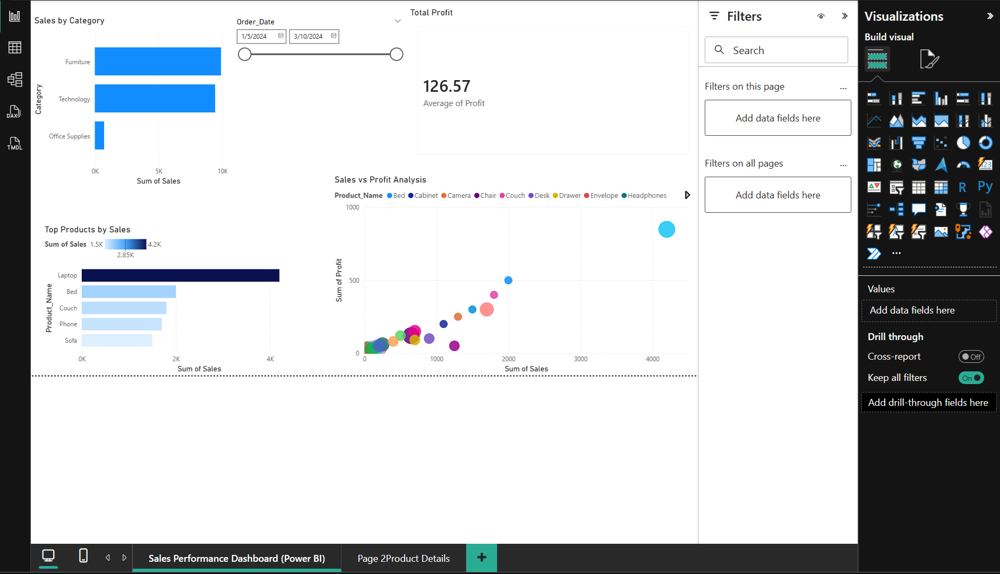

# Sales Performance Dashboard (Power BI)

This project focuses on analyzing sales and profit data using Power BI.

## Dashboard Preview:

## Key Features:
- Interactive dashboard with filters (date range, category)
- Visualization of sales by category and top products
- Sales vs Profit analysis using scatter plot

## Tools Used:
- Power BI
- Excel

## Insights:
- Identified top-performing products (e.g., Laptop)
- Observed relationship between sales and profit
- Highlighted underperforming categories
